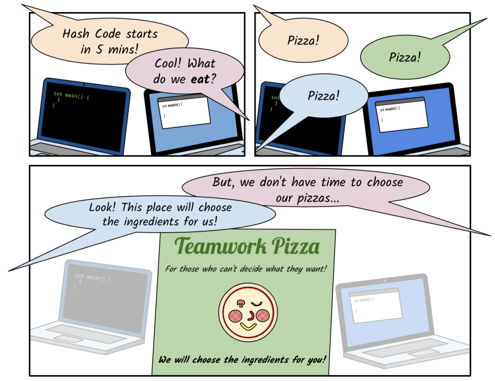
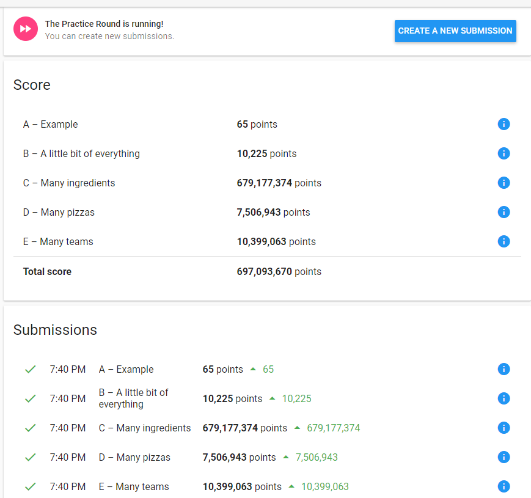

# practice problem : Even More Pizza

[Practice Problem](./practice_round_2021.pdf)

## How did I solve ?

1. get inputs
    - Team = [number of two-member Team, number of three-member Team, number of four-member Team]
    - ingredients : using heapq, heappush(array, (number of Ingredients, ingredients array, index of pizza))

2. distribute pizzas
    - Priority (1. Team-4, 2. Team-3, 3. Team-2)
        * number of Ingredients will be Squared
        * assume that picking more pizzas bring high score
    - Count Ingredients
        * using SET data structure and len() function
    - Mechanism
        * ingredients array will be sorted by length of ingredients (Descending)
        1. pick 2 pizzas from front of array
        2. add 1 pizza from next index - if it improves the score / else, give it to Team-2
        3. add 1 pizza from next index - if it improves the score / else, give it to Team-3
        4. give it to Team-4
        5. repeat 1 ~ 4 until all pizzas distributed or all team got pizzas 

3. save submission
    - first line : number of distributed pizzas
    - write distributed pizzas

## How much time did it take?

a - milli seconds
b - About 1 second
c - About 4 minutes
d - About 20 minutes
e - About 23 minutes

## Scores

## Review

I started to write my answer in one day before endline.
If I had more time, I could use better algorithm.
I'll need to make Optimization for my code.